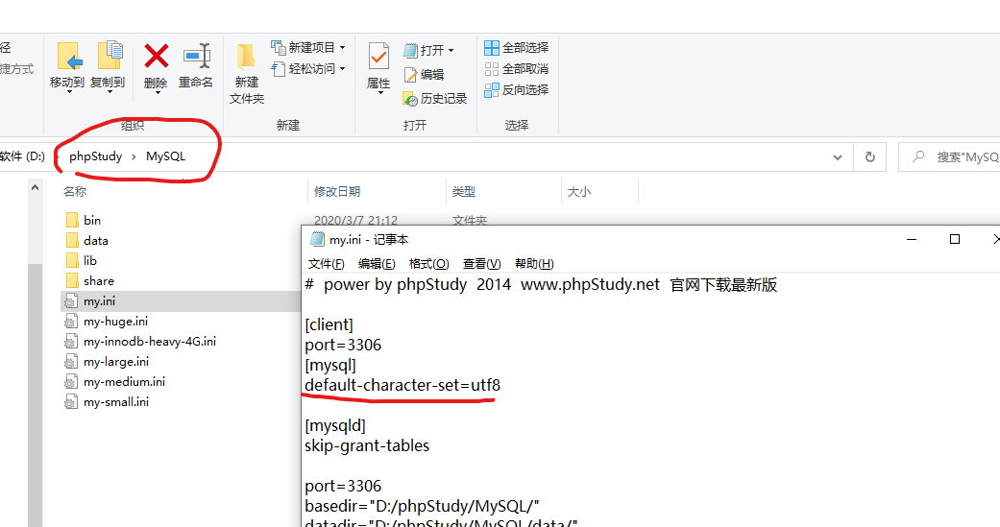

### 安装与配置

1. 启用vue ui 创建

2. 安装插件和依赖

3. 安装配合mysql

   
   
   


4. 启动后台
   - 第一次时，启动npm install，需要先安装
   - node app.js


---


### 需要复习点


1. 伪类相关的知识
2. 回调函数
3. 关于作用域插槽


```
http://127.0.0.1:8888/api/private/v1/login?username=admin&password=123456

file协议和http协议之间的区别
https://www.cnblogs.com/lishanlei/p/9327646.html


>>域名：一个URL中也可以使用IP作为域名，这个URL中域名为www.baidu.com

>>端口：跟在域名后，以“:”作为分隔符。如果省略端口，那么将采用默认端口。

>>虚拟目录：虚拟目录不是必须部分。是从域名后第一个“/”开始到最后一个“/”为止。

>>文件名：
从域名后的最后一个“/”开始到“？”为止，是文件名部分，如果没有“?”,则是从域名后的最后一个“/”开始到“#”为止，是文件部分，如果没有“？”和“#”，那么从域名后的最后一个“/”开始到结束，都是文件名部分。文件名部分也不是一个URL必须的部分，如果省略该部分，则使用默认的文件名。


     console.log(`每页 ${val} 条`)
     console.log('每页', val, '条')


     为什么是用el-row 和el-col


```


```

关于深拷贝：

// 执行添加的业务逻辑
// lodash   cloneDeep(obj)
// eslint-disable-next-line no-undef
const form = _.cloneDeep(this.addForm)
form.goods_cat = form.goods_cat.join(',')

```